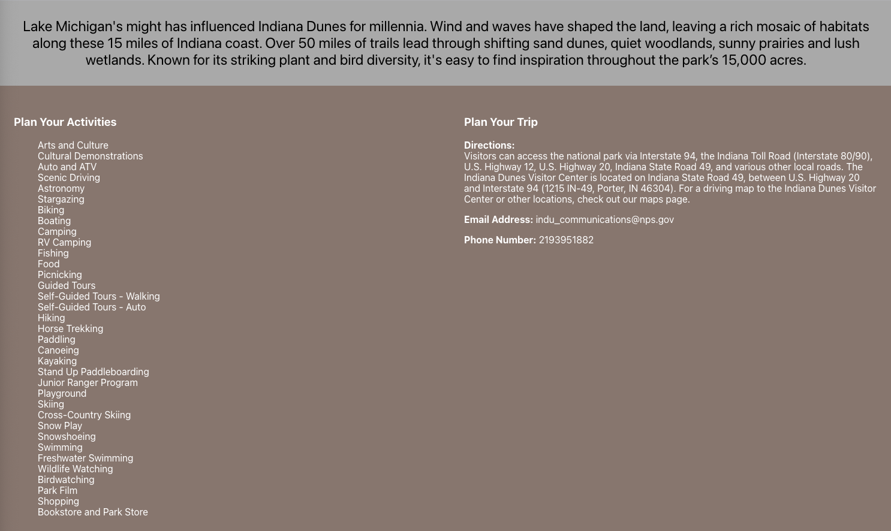

# ParkPlanner


### **ABSTRACT**
This project was assigned as part of Turing School of Software Design module 3 front end.  The purpose of this showcase solo project was to show all of the technologies we have been learning in an application of our own choosing and design. My ParkPlanner app accessed the National Parks api to access National Parks data for details of the park and images.  A user can search for and click on any National Park to see a description, activities you can do in the park, directions to the park, and finally contact information for the park.

### **APP PREVIEW**	





### **GOALS**

Use the technology you’ve been working with over the course of the module to -demonstrate mastery of the following:
-React
-Router
-Asynchronous JavaScript
-End to end testing with Cypress

### **CONTRIBUTORS**

- [Adrian Zabolizki](https://github.com/ganuza) 

### **INSTALLATION INSTRUCTIONS**

1. Install the prerequisites:
  Node.js
  npm
  Git
2. Clone the repository:
  Open a terminal window.
  Navigate to the directory where you want to clone the repository.
  Run the following command:
  ```
  git clone git@github.com:ganuza/parklanner.git
  ```
3. Install the dependencies:
  Run the following command in the cloned repository directory:
  ```
  npm install
  ```
4. Run the React app:
  Run the following command in the cloned repository directory:
  ```
  npm start
  ```
5. Open the app in your web browser by navigating to 
  ```
  http://localhost:3000
  ```
### **TECHNOLOGIES**
- JavaScript
- CSS
- HTML5
- React
- React Router
- Cypress
- GitHub
- GitHub Projects

### **WINS + CHALLENGES**

##### WINS
- Putting together newly learned technologies of React, Router, and Cypress testing to showcase all of my learning this module
- A beautiful app that is deployed and usable!

##### CHALLENGES
- Time constraint:  I had less than a week to complete this project
- Cypress testing:  It takes a bit of time to do robust testing
- Time Management:  It is a challenge to manage a project of this size with other school commitments